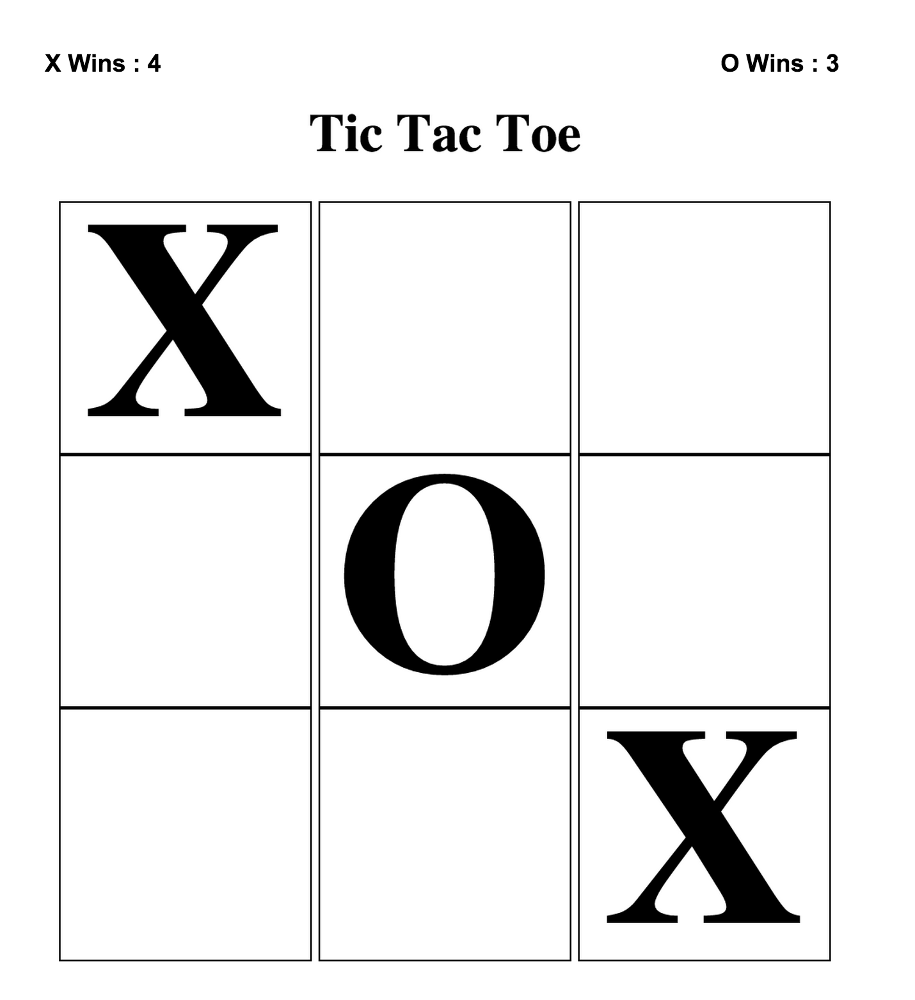
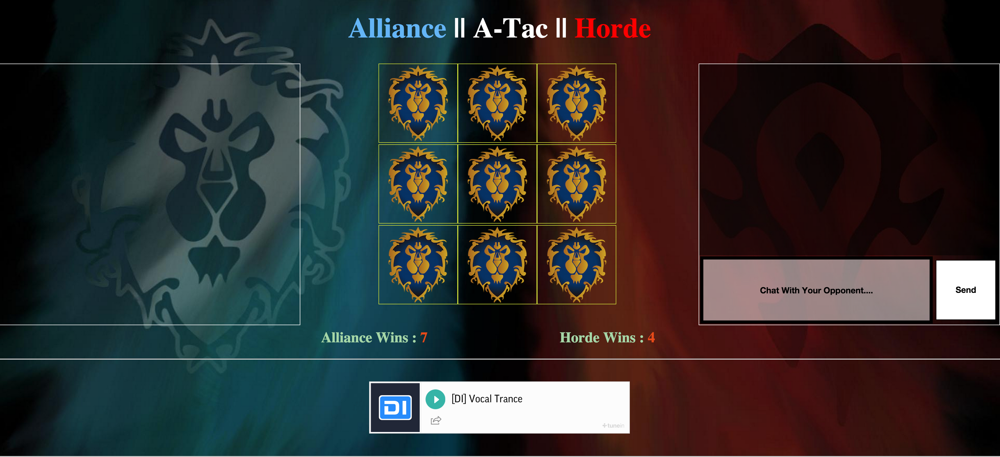
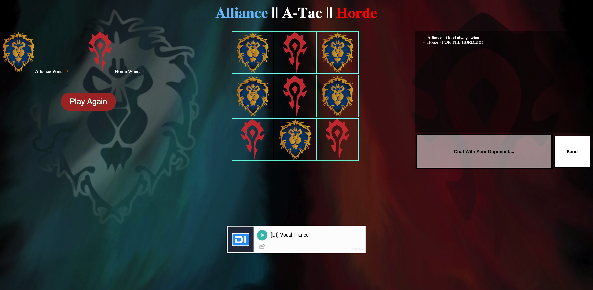

#This is the GitHub Repo for GA Project 01 [Tic Tac Toe / T3]

---
##### Done
1. Fully Functional 2 player Game of Tic Tac Toe or Alliance - A-Tac - Horde (World Of Warcraft Edition)
2. Win / Tie Voice Over Done by Rushi Sinha
3. Added a Background Video which autoplays on page load
4. Synced with Firebase (Turn Counter, Score, Pieces)
5. Works Fine So Far.

---
##### Known Bugs
1. On Game End only 1 screen shows victory (the screen that won) [Need to Sync the victory images to firebase]
2. Game Crashes sometimes when playing too quick [Might be related to Tie Logic]
3. Click Sounds are local and need to be synced to firebase to become global.

---

##### Please Report Any Further Bugs

---

##### Online Playable Link for Game

[Alliance A-Tac Horde](http://rushindra.com/ttt)

---

Here is the [Wireframe](https://docs.google.com/document/d/1ZLapBf3P6nVmzqguf8Og0ymC0eQ04-D-rgKpt147Qf8/edit?usp=sharing)

Version 0.1 [Wireframe Version]

Version 0.9 [Beta Version]

Version 1.0 [Current Version]

---

###Made by Rushindra Sinha